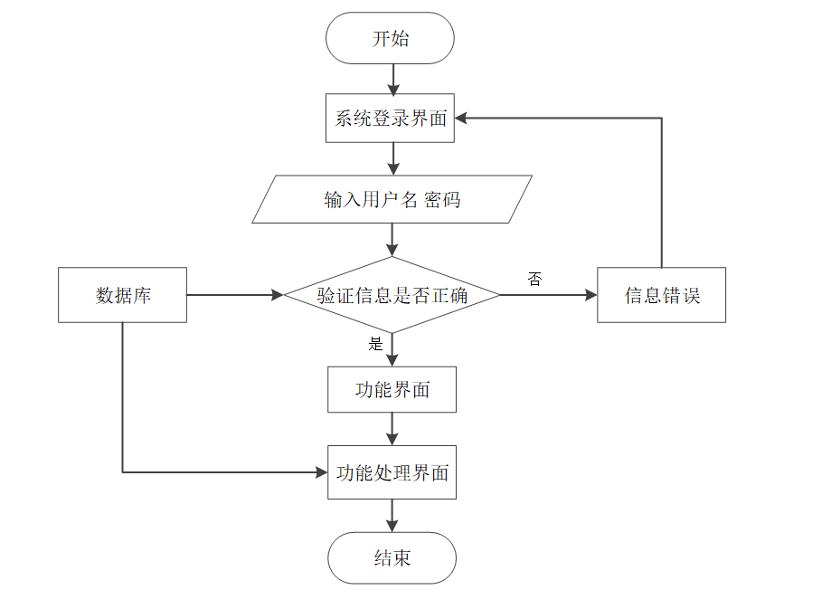

# 毕业设计精选-基于springboot技术的美食烹饪互动平台

<h4 style='color:red'>联系不到我，就看我的主页 </h4> 
 
#### 系统概要

本美食烹饪互动平台是基于Spring Boot框架开发的一款集美食分享、学习与交流于一体的综合性应用。该平台旨在为用户提供一个便捷、丰富的美食探索空间，同时赋予管理员高效管理平台的能力。通过整合前后端技术，实现了数据的快速处理与展示，为用户和管理员带来了流畅的交互体验。系统不仅涵盖了美食的展示与评价，还融入了美食知识的传播与教育，以及个性化的用户中心功能，构建了一个全方位的美食生态体系。

#### 研究背景

随着互联网的飞速发展和人们生活水平的日益提高，美食文化已成为人们日常生活中不可或缺的一部分。传统美食的传承与创新、新兴美食的探索与尝试，都激发了人们对美食的浓厚兴趣。然而，市场上虽然存在众多美食类应用，但大多侧重于单一的美食展示或点评，缺乏深度互动与知识分享的功能。此外，对于平台管理者而言，如何高效地管理海量数据、提升用户体验，也是一大挑战。因此，开发一个集美食展示、知识分享、用户互动与管理功能于一体的美食烹饪互动平台显得尤为重要。

#### 技术栈

后端技术栈：Springboot+Mysql+Maven

前端技术栈：Vue+Html+Css+Javascript+ElementUI

开发工具：Idea+Vscode+Navicate

#### 系统功能介绍

管理员角色功能模块  
个人中心：管理员登录后可查看个人信息、修改密码等，确保账号安全与管理便捷。  
基础数据管理：负责维护平台的基础设置，如站点名称、Logo、联系方式等，为平台提供统一的视觉形象与基本信息。  
公告管理：发布、编辑、删除平台公告，及时传达给所有用户重要信息或活动通知。  
美食管理：上传、审核、下架美食菜品，管理菜品分类与标签，确保美食信息的准确与丰富。  
美食知识管理：发布、更新美食制作教程、营养知识等内容，促进美食文化的传播与学习。  
用户管理：审核新用户注册、管理用户权限、处理用户反馈，维护平台秩序与用户满意度。  
轮播图信息管理：设置首页轮播图，展示热门美食或活动推广，提升平台吸引力。  

用户角色功能模块  
公告：查看平台最新公告，了解活动信息或重要通知。  
美食：浏览、搜索、收藏美食菜品，查看详细制作步骤与图片，学习烹饪技巧。  
美食知识：学习美食制作教程、营养搭配知识等，提升烹饪技能与饮食健康意识。  
个人中心：管理个人信息、查看收藏与浏览历史、设置偏好等，享受个性化服务。  
后台管理（部分功能）：  
公告管理（限特定用户）：部分高级用户或特定权限用户可参与公告内容的建议与反馈。  
美食管理（限特定用户）：用户可提交自己的美食作品，经管理员审核后展示，促进用户间美食分享。  
美食留言管理：对美食菜品进行评论、留言，与其他用户交流心得，增强互动性。  
美食知识管理（限特定用户）：参与知识内容的贡献与编辑，共同构建美食知识库。  

#### 功能结构设计

管理员权限操作的功能包括管理美食，对美食留言进行回复，管理美食知识信息，管理美食知识类型，管理用户，管理公告等。

用户权限操作的功能包括在线观看美食做法视频，查看美食食材信息以及美食详细介绍信息，查看美食知识以及公告信息等。

#### 系统流程

美食烹饪互动平台投入使用后，使用者如果能看到相应的流程操作图会提高程序的理解能力。

操作流程

使用者在操作美食烹饪互动平台中，应该按照本系统提供的操作流程进行操作，可以减少操作失误，从而节省进入美食烹饪互动平台的时间。

登录流程

美食烹饪互动平台通过登录功能引导使用者进入指定的功能操作区，也避免非本系统的用户享受本系统提供的服务以及查看本系统提供的信息，进而保证用户安全。

删除信息流程

美食烹饪互动平台在经过长期使用后，会产生很多的数据信息。为了腾出存储空间存放更多的数据，本系统数据库中存储的数据，一些没有参考价值的数据需要进行删除，删除数据过程中，为避免误删，使用者要根据系统的提示来决定是否删除数据。

添加信息流程

美食烹饪互动平台提供可视化的功能操作区，非常方便使用者进行数据操作，当使用者往系统中录入数据时（图3.4即为添加信息的流程），本系统也会进行数据合法性的判断，符合要求的数据才能够在数据库指定表中进行登记。

#### 系统作用

本系统通过构建完善的功能模块，不仅为用户提供了丰富的美食资源与知识分享平台，还通过高效的后台管理功能，保障了平台的稳定运营与持续优化。具体而言，系统的作用体现在以下几个方面：

促进美食文化传播：通过美食展示与知识分享，让用户更加深入地了解美食文化，激发对美食的热爱与探索。  
提升用户烹饪技能：提供详细的制作教程与营养知识，帮助用户提升烹饪技能，享受烹饪的乐趣。  
增强用户互动体验：通过评论、留言等功能，促进用户间的交流与互动，构建良好的社区氛围。  
优化平台管理效率：为管理员提供全面的管理工具，实现数据的快速处理与展示，提升平台运营效率。  

#### 系统功能截图

登录

公告模块

美食模块

美食知识模块

管理员端基础数据管理

公告管理

美食管理

用户端后台管理

#### 总结

本美食烹饪互动平台在深入研究当前美食类应用现状的基础上，针对市场上存在的空白与局限性，设计并实现了集美食展示、知识分享、用户互动与管理功能于一体的综合性系统。系统不仅丰富了用户的美食体验，还通过高效的后台管理功能，保障了平台的稳定与持续发展。未来，我们将继续优化系统功能，引入更多创新元素，为用户提供更加优质、便捷的美食烹饪互动体验。

#### 使用说明

创建数据库，执行数据库脚本 修改jdbc数据库连接参数 下载安装maven依赖jar 启动idea中的springboot项目

前台登录页面
http://localhost:8080/meishipengrenhudong/front/index.html

后台登录页面
http://localhost:8080/meishipengrenhudong/admin/dist/index.html

管理员				账户:admin 		密码：admin

用户				账户:a1 		密码：123456
